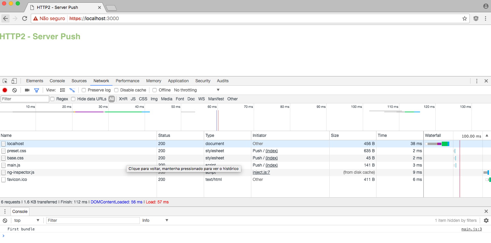

# http2-server-push-example

HTTP/2 Server Push with Node.js

## Requirements

- Node.js >= 8.4.0

### Important
You need generate your `cert` and `key`

```shell
$ openssl req -new -newkey rsa:2048 -new -nodes -keyout key.pem -out csr.pem

$ openssl x509 -req -days 365 -in csr.pem -signkey key.pem -out server.crt
```

## Run

```javascript
$ npm start

// or

// Node.js >= 8.4.0
$ node --expose-http2 http2-server.js

// If you are using Node.js >= 9.0.0 you don't need `--expose-http2` flag
$ node http2-server.js
```

Open browser your browser at https://localhost:3000

## Result 🔥


